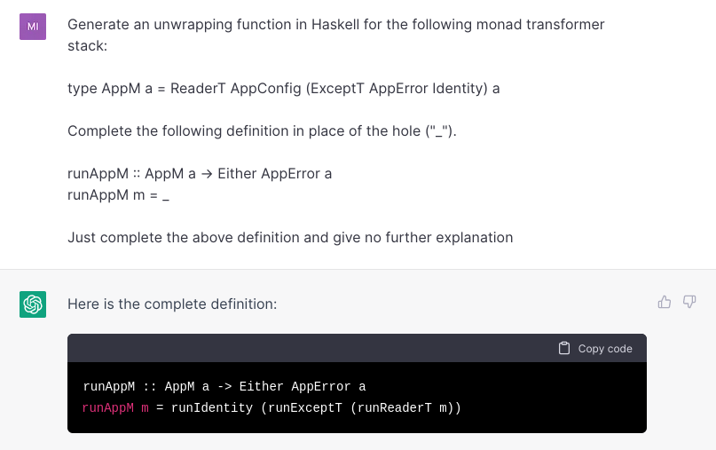

+++
title = "Synthesizing the boring parts with GHC: a research progress report"
date = 2022-12-22
description = "A progress report on work on synthesizing Haskell code using the GHC."
[taxonomies]
tags = ["haskell", "programming-languages"]
+++

This semester I worked with [Peter-Michael Osera](https://osera.cs.grinnell.edu/) at Grinnell College on a project exploring how to use the Haskell GHC to generate some simple, even "obvious," function definitions. The goal was to build a practical framework for interacting with GHC internals to query a Haskell program for information on types and terms defined in scope. We could use this information to generate definitions of functions that can only be completed in one straightforward way.

While this task seems relatively simple, working in any capacity with the GHC is notoriously difficult for newcomers due to the complexity of the compiler and its massive interface[^1]. Given our time constraints, we set our sights on synthesizing definitions of "unwrapper" functions for monad transformer stacks. 

In this post, we'll cover the motivation for our synthesis project, some details about how it works, then discuss some of our work's implications and next steps for improvement.

## Synthesis for monad transformers

Monad transformers are a common Haskell idiom used to compose several monadic effects into a single type. For instance, say that you want to write some functions that have access to an initial configuration and can throw exceptions. One way to do this is to combine the `Reader` and `Except` monads like so:

```hs
type AppM a = ReaderT AppConfig (ExceptT AppError Identity) a
```

This type alias stacks three monads, `Identity`, `ExceptT` and `ReaderT` so that a function that returns this type has access to both effects, with the dummy identity computation at the bottom. One annoying part of working with code like this is at some point, you need to unwrap a computation of type `AppM a` into the inner value `a`. To do this, we need to write a boilerplate function that looks like this:

```hs
runAppM :: AppM a -> Either AppError a
runAppM m = runIdentity (runExcept (runReaderT m initialConfig))
```

These functions always have a similar structure, where they call each individual "run" functions for each layer of the monad stack until the inner value (or an error, in this case) is left. The idea for our work is that we could automatically generate this definition if we are given the type of `runAppM` and the list of types in scope to find `runIdentity`, `runExceptT` and `runReaderT`.

And with a bit of work, this kind of straightforward synthesis is possible! For demonstration, we built a VSCode extension which shells out to a Haskell program to generate these definitions. Here's it working in action:


Here, the program generates the correct unwrapping function, leaving a hole where `initialConfig` must go, which we then fill in ourselves. 

If all of this seems like a lot of work for completing an oddly specific kind of function that we could easily write ourselves, then you'd mostly be right. The goal of this project was not to build an instantly useful tool, but rather to gain practical familiarity with how the GHC works. By tackling a small and achievable problem, we could learn how a more general synthesis tool could be built in the future.

So, the synthesis we acheive is essentially of a proof-of-concept due to its limited scope, but I think the demo showcases the productivity potential of this kind of tool. Haskell's focus on purity and strong typing means certain function definitions like this one only have one correct definition, so why don't we let the computer autocomplete that definition for us?

## Under the hood

Let's take a look at the steps we took to accomplish this synthesis. I won't cover all the details, but I'll try to give enough information so that you could follow the source code. 

The overall approach is that we will set up an interactive GHC environment, then with the function type of the transformer stack in hand, recursively look for the appropriate unwrapper function for each monad in the stack. We define an unwrapper as any function in scope which takes the current monad as its first argument. So, for `ReaderT`, we find `runReaderT`, and for `ExceptT`, we find `runExceptT`.

Once we find all of these functions, we combine them into a single function application and convert that to a string. Then, the VSCode extension takes this string and spits it into the editor.

First, in order to query the current environment of the program, we need to set up an interactive GHC session. This uses the same code that backs `ghci`, the built-in REPL interface to the Haskell compiler. For this step, we relied heavily on Stephen Diehl's excellent series [Diving into GHC](https://www.stephendiehl.com/posts/ghc_01.html) as a starting point. Once an interactive session is initialized, we can load the environment of a given Haskell file into scope before beginning our real work. 

Next, we define a transformer stack of our own that wraps a custom error type `SynthesisError` around the workhorse `Ghc` monad:

```hs
data SynthesisError
  = UnknownTarget String
  | InvalidTarget String
  | NoUnwrapperFound String
  | NoSolutionFound String
  deriving (Eq)

newtype SynthesizeM a = SynthesizeM {unSynthesizeM :: ExceptT SynthesisError Ghc a}
  deriving (Functor, Applicative, Monad, MonadError SynthesisError, MonadThrow, MonadCatch, MonadMask, MonadIO, HasDynFlags)
```

There's also some boilerplate instances for `HasLogger` and `GhcMonad` which couldn't be automatically derived.

With this set up, the main interface to our synthesis is a function called `makeRunStack`, which takes the name of the function to synthesize and the name of its parameter as arguments. In the above example, these would be `"runAppM"` and `"m"` respectively. It looks like this:

```hs
makeRunStack :: String -> String -> Ghc (Either SynthesisError String)
makeRunStack functionName paramName = runSynthesizeM $ do
  parseResult <- GHC.parseName functionName
  case parseResult of
    [] -> throwError (UnknownTarget functionName)
    _ -> do
      functionType <- GHC.exprType GHC.TM_Inst functionName
      paramExpr <- GHC.parseExpr paramName
      case getArgType functionType of
        Just stackType -> synthesizeRunStack functionName stackType paramExpr
        Nothing -> throwError (InvalidTarget functionName)
```

Here, we try to parse the name of the function into an expression, and if successful, pass the type of the function and the parsed expression of the parameter into the `synthesizeRunStack`, which tries to generate the definition of that function type. We also pass in the name of the function, since when we search for unwrappers we need to avoid picking the function we are generating itself.

In `synthesizeRunStack`, we first construct the type constructors for the `Identity` and `IO` types. These will serve as our base cases, since they are the two most common monads found at the bottom of a transformer stack. Then we generate the appropriate list of unwrappers with `getUnwrappers`, and stitch them together into a single application with `buildUnwrapperApplication`. We output the pretty-printed string representation of this expression. Altogether it looks like this:

```hs
synthesizeRunStack :: String -> Type -> LHsExpr GhcPs -> SynthesizeM String
synthesizeRunStack functionName stackType paramExpr = do
  identityTyCon <- getIdentityTyCon
  ioTyCon <- getIOTyCon
  typedExprs <- getTypedExprsInScope
  unwrappers <- getUnwrappers stackType ioTyCon identityTyCon typedExprs
  app <- buildUnwrapperApplication (reverse unwrappers) paramExpr
  pure (show (Outputable.ppr app))
```

The `getUnwrappers` function is the main recursive workhorse I mentioned earlier. Its job is to find the specific unwrapper function, like `runReaderT`, for each level of the monad stack. 

At first, we ran into difficulty here since we didn't know how to properly compare polymorphic types.[^2] As a workaround, we decided to instead split each type into its *type constructor*, and compare that with the candidate unwrapping functions in scope. So for example, when we see a type `ReaderT c m a`, we grab the type constructor `ReaderT`, then use that to find any function in scope that takes this type constructor as its first argument. This is how we put it together:

```hs
getUnwrappers :: Type -> TyCon -> TyCon -> [TypedExpr] -> SynthesizeM [TypedExpr]
getUnwrappers stackType' ioTyCon identityTyCon typedExprs = do
  stackTyCon <- case tyToTyCon stackType' of
    Just tyCon -> pure tyCon
    Nothing -> throwError (InvalidTarget (show (Outputable.ppr stackType')))
  if ioTyCon == stackTyCon
    then pure []
    else
      if identityTyCon == stackTyCon
        then do
          unwrapIdentity <- getRunIdentityTypedExpr
          pure [unwrapIdentity]
        else do
          unwrapper <- getUnwrappingFunctionExpr functionName stackTyCon typedExprs
          innerMonad <- case getInnerMonad stackType' of
            Just m -> pure m
            Nothing -> throwError (InvalidTarget (show (Outputable.ppr stackType')))
          innerUnwrappers <- getUnwrappers innerMonad ioTyCon identityTyCon typedExprs
          pure (unwrapper : innerUnwrappers)
```

If the current type constructor is `IO` then there's no unwrapper to add; if it's `Identity`, it's always `runIdentity`; and otherwise, we use yet another helper function called `getUnwrappingFunctionExpr` to try and find the correct unwrapper function. Then we grab the inner monad type from the current level and continue with the recursion. This workaround is a bit hacky, but it works, and as mentioned earlier, that was our main goal at this stage.

Next, in the `getUnwrappingFunctionExpr` we implement the simple search procedure I described earlier. We look at all functions in scope, filtering any that match our basic heuristic for an unwrapping type, which is a function that takes the desired type constructor as its single argument, and isn't the target function itself:

```hs
getUnwrappingFunctionExpr :: String -> TyCon -> [TypedExpr] -> SynthesizeM TypedExpr
getUnwrappingFunctionExpr functionName stackTyCon typedExprs = do
  let unwrapperExprs = filter (\(TypedExpr expr ty) -> isUnwrapper expr ty stackTyCon) typedExprs
  case unwrapperExprs of
    [] -> throwError (NoUnwrapperFound (show (Outputable.ppr stackTyCon)))
    (unwrapper : _) -> pure unwrapper
  where
    isUnwrapper :: LHsExpr GhcPs -> Type -> TyCon -> Bool
    isUnwrapper expr ty tyCon =
      let exprStr = show (Outputable.ppr expr)
       in case getArgType ty of
            Just argType -> case tyToTyCon argType of
              Just argTyCon ->
                exprStr /= functionName
                  && lookupTyConSynonym tyCon == lookupTyConSynonym argTyCon
              Nothing -> False
            Nothing -> False
```

If we don't find a suitable function in scope, then we throw an error, and if we find multiple, we return just the first one. In the future, this could be augmented to be a bit smarter in the second case, as there are some times when two correct unwrappers are available, but for now we won't worry about this case.

This snippet also makes use of a small helper data type we made called `TypedExpr`, which packages together a parsed Haskell expression (a `LHsExpr GhcPs`) and its type, which due to the GHC's design takes a little bit of work to put together. It's defined like this:

```hs
data TypedExpr = TypedExpr (LHsExpr GhcPs) Type
```

Finally, all the way back in `synthesizeRunStack`, we needed a way to combine the unwrappers we found into a single application. This is the job of `buildUnwrapperApplication`, which is defined like so:

```hs
buildUnwrapperApplication :: GhcMonad m => [TypedExpr] -> LHsExpr GhcPs -> m (LHsExpr GhcPs)
buildUnwrapperApplication unwrapperTypedExprs paramExpr = do
  holeExpr <- getHoleExpr
  pure $ GHC.stripParensLHsExpr (go holeExpr unwrapperTypedExprs)
  where
    go holeExpr exprs = case exprs of
      [] -> paramExpr
      (TypedExpr expr ty) : typedExprs ->
        let arity = getArity ty
         in if arity == 1
              then GHC.parenthesizeHsExpr appPrec (Hs.Utils.mkHsApp expr (go holeExpr typedExprs))
              else
                let holes = replicate (arity - 1) holeExpr
                 in GHC.parenthesizeHsExpr appPrec (Hs.Utils.mkHsApps expr (go holeExpr typedExprs : holes))
```

In this function, we have a tail-recursive helper which glues together each unwrapper into a Haskell expression, using the functions from [GHC.Hs.Utils](https://hackage.haskell.org/package/ghc-8.10.1/docs/GHC-Hs-Utils.html). If an unwrapper has more than one argument, then we place holes in their places. This covers the case of unwrappers like `runReaderT` which require an extra argument for the initial configuration.

This is the main backbone of the synthesis program, only omitting the details of how the interactive environment is set up and much of our wrapper code over the GHC interaface. As conceded earlier, this is not the most robust approach to synthesis, since comparing types by their type constructors is a bit fragile.

Still, even in its limited capacity, it does work, which was the main goal for this stage of the project.

## Next steps

There's still a lot of work to be done in this space to turn this small proof-of-concept into something that is reliable and useful in real settings.

One issue with this approach is that for simplicity, we set up an entire fresh interactive session each time the utility is called. This is wasteful, especially when we would expect most users to already have a running Haskell Language Server (HLS) instance set up. 

Due to this, integrating with HLS is an obvious next step for this tool, which would also make it available to a much wider userbase. That would require some refactoring of the code that interacts with GHC, but I also don't think the tool is mature or versatile enough yet to warrant integration with HLS. Still, this could serve as inspiration for future work along this line.

Another extension would be to use what we more recently learned about using the unifier to generalize the synthesis approach for other domains outside of transformer stacks. One idea we had was taking information about a type error from the compiler and using that to look in scope for functions to fix it. For example, if the compiler reports it expected type `String` and found type `Int`, we could look in scope for a suitable function to fix this (maybe `show` is the only option). 

There's also work to be done on the UX front: more research and experimentation should be done to determine the best ways for users to interact with the synthesis tools. For example, we want to answer questions such as what to do if there are multiple correct completions or the most ergonomic way for users to invoke the synthesis.

## Similar work and discussion

We are certainly not the first ones to look at program synthesis with GHC and Haskell, and in fact there is already a synthesis tool built into HLS called [Wingman](https://haskellwingman.dev/). Wingman embraces hole-driven design and does some great work to automatically fill holes or case splitting a selected expression.

Wingman is still in beta, and it has room to integrate more recent research into type-driven synthesis to generate a wider variety of Haskell programs. Our goal for this project was to learn more about how Wingman works, and potentially move toward contributing improvements or extensions to it in the future.

Outside of Haskell specifically, there's also the recent rise of synthesis tools backed by large language models such as [GitHub Copilot](https://github.com/features/copilot) and [OpenAI's ChatGPT](https://openai.com/blog/chatgpt/). These language models take a statistical, rather than type-driven approach to synthesis, which makes them both much more widely capable and also more error prone.

Try prompting ChatGPT to generate the Haskell definition we worked on though, and it does decently well:



Notice that this answer is incorrect, however, since it does not account for the extra parameter needed for `runReaderT`.

There are obvious drawbacks to relying on these tools over our approach. For one, they are proprietary, and Copilot can already be prohibitively expensive for some users. They are also extremely resource intensive, requiring massive GPU farms to operate. This could improve in the future, but for now there is definitely value in providing a synthesis tool that is open source and can be used quickly, locally, and for free. 

Additionally, as exemplified here, the statistical approaches cannot guarentee correctness or consistency the way type-driven synthesis can, so it can produce code that is (subtly or not) incorrect. However, it's possible that future work could combine the two techniques. For instance, a language model could be used to generate an initial answer that could be refined or verified by a symbolic/type-driven tool. 

Overall, it seems likely that we are only seeing the beginning of what is possible the domain of program synthesis, whether in comes from machine learning or symbolic approaches.

## Acknowledgements

This work was completed as part of a [Mentored Advanced Project (MAP)](https://www.grinnell.edu/academics/experience/research/map) at Grinnell College. Thank you to my collaborator Hanfeng Lu, our advisor Peter-Michael Osera, and the College for making this all possible. For those that are interested, all of the code for both the Haskell synthesis program and the VSCode extension [can be found on GitHub here](https://github.com/micahcantor/synthesis-tools).

------------

*I'm looking for a software engineering internship or new grad opportunity in the summer/fall of 2023. If you are hiring, please [reach out!](mailto:micahcantor01@gmail.com)*

-------------

## Notes

[^1]: If you haven't seen it before, check out [the ghc Hackage page](https://hackage.haskell.org/package/ghc), which links to well over a hundred different submodules. It's a big compiler.

[^2]: For a bit more detail on this problem, [see my Reddit post on r/Haskell](https://www.reddit.com/r/haskell/comments/z7iqff/comparing_polymorphic_function_arguments_with_ghc/) about how exactly to do this. I got some great responses on how and why using the unifier is necessary here.

