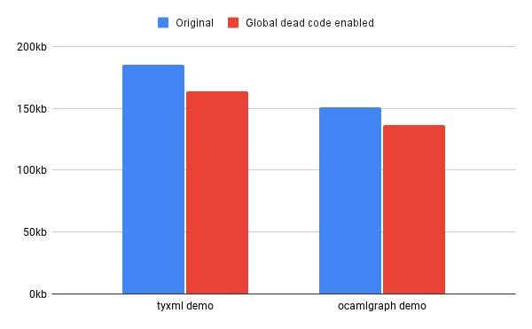

+++
title = "Improving the dead code elimination algorithm in js_of_ocaml"
date = 2023-11-13
description = "Reducing code size with a new global optimization pass in js_of_ocaml."
[taxonomies]
tags = ["ocaml", "programming-languages"]
+++

*I'm looking for a full-time software engineering position starting in January 2024. If you or your team is hiring, please [reach out](mailto:micahcantor01@gmail.com)!*

## Introduction

This summer I worked as a software engineer intern at [Tarides](https://tarides.com/) from their Paris office. My project centered on improving the dead code elimination algorithm in the OCaml to JavaScript compiler, [js_of_ocaml](https://github.com/ocsigen/js_of_ocaml). In this post, I'll give some background on why these changes were needed and an overview of the implementation of the new pass. Then, we'll benchmark the effect of the changes and talk about opportunities for future improvement.

### Basics of js_of_ocaml

Js_of_ocaml is a bit of a strange compiler. Rather than compiling directly from OCaml to JavaScript, the input to `js_of_ocaml` is actually OCaml bytecode, a low level representation that's usually either executed by the OCaml VM or compiled down further to native code. This choice was made because although changes are frequently made to OCaml, the bytecode rarely sees significant changes, which makes `js_of_ocaml` easier to maintain. 

As a consequence, the compiler has to take a low-level representation and lift it up into a higher-level representation in JavaScript. The simplified pipeline of the compiler looks like this:


In this post, we'll be focusing specifically on the optimization pipeline and the IR, which try to speed up or shrink the program without changing its behavior.

One of these optimizations is dead code elimination, which tries to remove unused code. The basic strategy is to statically analyze the program and determine any unreachable code to remove. The most common source of dead code is from including libraries or modules. Since OCaml has static module resolution, all imports are resolved at compile time, which means we can statically determine which functions from these modules are unused.

Although useful in any compiler, dead code elimination is particularly important when compiling to JavaScript, since code size is directly correlated to the execution speed of a web page, especially for those with slow network connections. In the JavaScript ecosystem, dead code elimination is usually referred to as [tree shaking](https://en.wikipedia.org/wiki/Tree_shaking), and is performed by every modern JavaScript bundler, like [webpack](https://webpack.js.org/) or [esbuild](https://esbuild.github.io/). However, tree shaking can only be used on ES6-style modules, a newer implementation of JavaScript modules that also guarantee static resolution. 

But `js_of_ocaml` was created before the adoption of ES6, and so instead it compiles all generated code into a single-file executable. This means that code produced by `js_of_ocaml` can't take advantage of traditional JavaScript bundlers, and must eliminate dead code itself. This algorithm is generally successful, and the compiler is able to produce small, fast JavaScript executables. But there is a limitation in its design that prevents it from removing *all* dead code. Addressing that limitation was the main purpose of this project.

### A motivating example

To motivate this discussion, let's look at a small program that sees a large change from the new pass. Here's an OCaml program that creates two instances of the `Set` module and uses a few of its functions:

```ml
module Int_set = Set.Make (Int)
module String_set = Set.Make (String)

let int_set = Int_set.singleton 1 in
let string_set = String_set.add "hello" (String_set.empty) in
print_endline 
  (string_of_int (Int_set.find 1 int_set) 
  ^ (String_set.find "hello" string_set))
```

When we compile this program with `js_of_ocaml` we find the size of the generated JavaScript is 33kb. But with the new pass enabled, that size becomes just 24kb, a reduction by about 27%! 

Where does this improvement come from? It turns out that even though our program uses only a handful of the functions in the Set module such as `singleton` and `add`, without the new pass, all of the thirty-plus functions in `Set` are compiled and included in the JavaScript executable.

This example exposes the primary motivation for this work, which was to fix a limitation in `js_of_ocaml` that prevented it from removing unused code from higher-order modules, what OCaml calls [functors](https://ocaml.org/docs/functors), like `Set` or `Map`. This post will focus on why this limitation existed at all, and how the new pass fixes it.

## Background: The original algorithm

### Control flow analysis

To understand how the new pass works, we first need to understand the original dead code elimination algorithm in `js_of_ocaml` and its limitations. The original algorithm operates mostly how you would expect if you designed it from first principles: traverse the program and mark each piece of code we visit as reachable, then remove the rest. 

To determine whether code is reachable, we first need to build the **control-flow graph** (CFG). This is an intermediate representation of the program where nodes are blocks of code and edges are control flow statements, like conditionals or function calls. The algorithm performs a depth-first search of this graph to determine which blocks and variables are used. As an example, consider the following small program:

```ml
let foo x = if x == 0 then x + 1 else x - 1 in
let bar x = x + 1 in
foo 1
```

Here, we should mark the function `bar` as dead code, and indeed this property can be determined by analyzing corresponding CFG:


Starting from the entry point `foo 1`, we search the graph and mark the blocks corresponding to `foo x`, `x + 1` and `x - 1` as live. In this search, we never visit the block for `bar x`, so it can be marked as dead code. 

With the CFG, it's easy to determine reachability for blocks, but understanding if variables are used is trickier. Consider the following example:

```ml
let y = 1 in
let y = 2 in
let x = y in 
print_int x
```

At a glance, it's easy to see that the first assignment (`y = 1`) is dead code and can be removed, but how can we determine this in general? After all, `y` is used in the definition of `x`, which itself is printed out. The key is to first transform the variable names into **single static assignment** (SSA) form. In this representation, we give each variable a fresh name when it's reassigned or used as a function argument. The above program then looks like this:

```ml
let x_1 = 1 in
let x_2 = 2 in
let x_3 = x_2 in
print_int x_3
```

In this form it's clear that we can remove `x_1` from the program. Another important property of the program in SSA form is that since each variable has exactly one definition. This means we can store the variable definitions and other metadata in a flat array indexed by the variable's fresh name.

### Liveness of return values

With this approach, we can determine whether individual variables or whole blocks are used. But dead code analysis becomes more complicated if we try to determine whether the return value of a function is used. Note that because of side-effects, this task is different than determining whether a function is used at all. Consider this example:

```ml
let foo x =
  print_int x;
  x + 1
in
ignore (foo 1)
```

Even though the return value of `foo` is never used, we still can't eliminate the function entirely. If we did, the behavior of the program would change since we'd lose the side-effect of printing `x`. But since the return value of `foo` is never used, we could still save some space by modifying the definition of `foo` to be:

```ml
let foo x = print_int x;
```

This may not have as large of an effect on code size as removing `foo` entirely, but small optimizations like this can add up. Unfortunately, the problem of determining whether a return value is dead is significantly more difficult than our previous examples of dead code analysis. In fact, it's not a property we can determine with just a single traversal of the CFG. To see why, consider another example:

```ml
let foo x =
  print_int x;
  x + 1
in
let y = foo 1 in
let z = y in
print_int 0
```

The corresponding CFG for this program looks like this:


In this case, control moves from the entry block to the body of `foo`, and then is returned to the caller. On inspection, we can see that `y` is only used in `z`, and `z` is never used. Therefore, `y` and `foo` should both be marked dead. But crucially, this property can't be determined just from the CFG. Instead, we need to consider the liveness of each variable where `y` is used (in this case, just `z`). 

In essence, to determine the liveness of return values, we need a graph of all variables in the program, where edges represent dependencies between them. Suddenly, the task of dead code elimination seems much more difficult: rather than a single pass over the CFG, we need track the liveness of each variable, then propagate information about their usage back to all of their dependencies. This is indeed the strategy taken by the new pass that we'll describe in more detail later.

But for simplicity and speed, the original dead code elimination pass makes a simplifying assumption: all return values are live. For this reason, we call the original algorithm an *intra*-procedural optimization rather than an *inter*-procedural (or global) optimization. This heuristic may seem harsh, but it turns out to be correct in most important cases: The OCaml compiler itself can find unused variables like `z` in the above example, and functions from modules that are imported but not used (the main source of dead code) can usually still be removed.

### The functor limitation

The restriction of dead code analysis to within functions is mostly sufficient, but it fails to remove unused code from functors. To see why, we need to understand the memory model for functors in `js_of_ocaml`.

In the low-level representation of OCaml bytecode, modules are just flat arrays of variables. For example, consider the `String` module:

```ml
module String = struct
  let make n c = ... in
  let get s i = ... in
  ... (* more definitions *)
end
```

In (pseudo) bytecode, `String` is represented as an array like so:

```ml
let String = 
  let make n c = ... in
  let get s i = ... in
  ... (* more definitions *)
  [|make; get; ...|]
```

Since functors are just functions from one module to another, in bytecode they're naturally represented as functions from one array to another. So when we create a particular instance of a functor in OCaml, the bytecode representation is just a normal function call. Take this for example:

```ml
module String_set = Set.Make (String)
```

In bytecode, this is essentially compiled to:

```ml
let Set_make t =
  let t_singleton x = ... in 
  let t_add x s = ... in
  ... (* more definitions *)
  [|t_singleton; t_add, ...|]
in 
let String_set = Set_make String in
```

From this, we can see that under the hood, `String_set` is just the return value of the application of `Set_make` to the `String` module. By our previous discussion, that means `String_set` will always be marked as live. As a consequence, even if we only use a small number of the functions from `String_set`, all of the function definitions will be included in the executable.

To fix this limitation, we need to extend the pass with the variable-level analysis discussed previously. But we actually need a little more: the new analysis needs to track the liveness of each entry in an array. In particular, it's not sufficient to know if `String_set` is either entirely live or dead. Instead, we need to track whether each entry in the array like `string_empty` or `string_add` is live. Then we can remove all the unused entries (and therefore all unused functions) from the program. 

## Global dead code elimination

With the background of the original algorithm established, we're now ready to discuss the new implementation in detail. There are three main steps involved in the new algorithm. First, compute the initial liveness of variables with a pass over the IR. Then, propagate that information through the variable dependency graph. Lastly, zero out dead variables and array entries so they can be removed by the original algorithm.

### Initial liveness

The first step of the new pass is to obtain a conservative estimate of the liveness of each variable. Rather than just a binary live or dead, each variable can have one of three states: `Top` (a live, non-block expression), `Live f` (a live block with a set of live fields `f`), or `Dead`. This is characterized in the type `live`:

```ml
type live =
  | Top
  | Live of IntSet.t
  | Dead
```

In the initial liveness pass, we iterate over each instruction in the IR and set each variable to one of these three states. To understand how the initial liveness is set, there are two existing modules in `js_of_ocaml` to discuss, which compute expression purity and global flow.

The task of determining which expressions are pure is handled by the `Pure_fun` module. It works by analyzing the definition of a given function and determining whether it contains any impure instructions. At a lower level, `js_of_ocaml` is aware of which instructions are pure by explicit labeling the purity of built-in procedures. For instance, a low-level IO operation like `read` or `write` is implemented by the `js_of_ocaml` runtime and is explicitly labeled as impure. Meanwhile, the built-in integer addition procedure would be labeled as pure.

We also need information about the values that function parameters and returned variables can take across the whole program. This global analysis is performed by `Global_flow`, which was originally developed to support OCaml 5's effect handlers in `js_of_ocaml`. The module's analysis returns a table of variables and their possible values across the whole program. Since some functions may be called hundreds or thousands of times in a program, for the sake of efficiency, there is an upper limit on the number of potential values a variable may have before it's considered to be "escaping."

With this information, we can determine the initial value for the liveness of a variable `x`. If `x` appears in an impure expression and it escapes our global flow analysis, then we set `x` to `Top`. In this case, we don't know whether removing `x` would change the behavior of the program, so we must assume it should remain. However, if `x` appears in a pure expression, like `y = x + x`, then initially we consider `x` to be `Dead`. It's possible `y` itself is used in an impure context, but we can't determine this during the initial pass.

As an example of how this works, let's look at this program, which is roughly in SSA form:

```ml
let foo x =
  [|x.(0); x.(1)|]
in
let y = [|1; 2; 3|]
let z = foo y in
let sum = z.(0) + z.(1) in
print_int sum
```

The function `foo` is given an array `x` and returns a new array including only the first two entries. Using the original algorithm, we wouldn't be able to determine that the third entry of `y` is dead (in this case, the constant `3`) since the transformation occurs across a function boundary. After the initial pass, we have the following variable liveness table:

| Name   | Liveness |
| ------ | -------- |
| `foo`  | `Dead`   |
| `x`    | `Dead`   |
| `y`    | `Dead`   |
| `z`    | `Dead`   |
| `sum`  | `Top`    |

Here, `sum` is marked as `Top` since it used in an impure expression `print_int sum`. Every other variable is only used in a pure context, so they remain `Dead` for now.

The liveness analysis during the initial pass is intentionally overzealous, as many of the variables initially marked as `Dead` will be turned to `Top` during propagation. Importantly though, after the initial pass, arguments and return values like `y` and `z` aren't automatically marked as `Top`. This means that if they remain unused after propagation, they can be removed from the program, addressing the original algorithm's limitation.

### Liveness propagation

Once the initial liveness is computed, the next step is to propagate this information through the variable dependency graph. To do so, we use a technique called [data-flow analysis](https://en.wikipedia.org/wiki/Data-flow_analysis). The algorithm continually computes the liveness of each variable in the graph until none of the values change. At each iteration, we only recompute the liveness of a variable when the liveness of one of its dependencies changed in the previous step.

The first step is to build the variable dependency graph, which is performed in a function called `usages`. The edges in this graph are directed, and can be of two types, which is captured by the type `usage_kind`:

```ml
type usage_kind = Compute | Propagate
```

If a variable `x` is used in the definition of a variable `y`, then we add an edge of type `Compute` from `x` to `y`. Alternatively, if `x` is applied as a function argument to the parameter `y`, then we add an edge of type `Propagate` from `x` to `y`. This distinction is important during propagation: the liveness of variables joined by `Compute` will be combined, whereas the liveness of variables joined by `Propagate` will simply be transferred directly.

The actual construction of this graph is relatively routine: we traverse the IR and add edges between variables as appropriate in each instruction. The only complication comes when analyzing function applications. From the global flow analysis, we have information on possible arguments for each function. In our graph, we add `Propagate` edges between each parameter and its possible arguments. This is crucial to ensuring the liveness analysis remains correct across function calls after the dependency propagation.

To continue the previous example, here's what the variable dependency graph looks like:


The function `foo` is used to compute the return value `z`. The array `z` is used to compute the `sum`. The parameter `x` is used to compute `foo`. And the liveness of parameter `x` propagates to the argument `y`.

With the variable dependency graph constructed, the next step is to write the propagation function for the data-flow solver, aptly named `propagate`. In each iteration, to compute the liveness of a variable, we combine its current liveness with the contribution of each of its dependencies. Before the first step, the liveness of each variable is set with the initially computed value.

If a `Dead` variable `v` is used to compute a `Top` variable `w`, then `v` should also be `Top` since it can't be removed from the program. In this sense, `Top` "wins" when combined with other liveness values. Alternatively, if `v` is an array with `Live f1` and later we find that another set of fields `f2` are also live, then the total set of live fields is the union of `f1` and `f2`. Concretely, the function `join` is used to combine two liveness values:

```ml
let join l1 l2 =
  match l1, l2 with
  | _, Top | Top, _ -> Top
  | Live f1, Live f2 -> Live (IntSet.union f1 f2)
  | Dead, Live f | Live f, Dead -> Live f
  | Dead, Dead -> Dead
```

The name `join` comes from the fact that the domain of variable liveness forms a hierarchical algebraic structure called a [lattice](https://en.wikipedia.org/wiki/Lattice_(order)). Although not crucial to understanding the implementation, this terminology can be helpful for verifying the properties of live variables.

To compute the liveness of a variable `v`, the `propagate` function must compute the liveness contribution of each dependent variable `w`. If the two variables are connected by a `Propagate` edge, then the contribution is simply the current liveness of `w`. Otherwise, if `v` and `w` are connected by a `Compute` edge, then there are three cases based on the current liveness of `w`:

1. If `w` is `Dead`, then the contribution is `Dead`.
2. If `w` is a live block, then the contribution is `Top` if `v` is one of the live fields of `w`, and otherwise `Dead`.
3. If `w` is `Top` and `w` is defined by a field access to entry `i`, then the contribution is `Live {i}`. This means `v` depends only on that single field of `w`. Otherwise, the contribution is `Top`.

These rules are wrapped into a function `contribution y usage_kind`. Finally, to compute the total liveness of `x`, we use `fold` to join its current liveness and the liveness contribution of each dependency:

```ml
Var.Map.fold
  (fun y usage_kind live -> join (contribution y usage_kind) live)
  (Var.Tbl.get uses x) (* dependencies of x *)
  (Var.Tbl.get live_table x) (* current liveness of x *)
```

Returning to the example from above, after propagation the liveness table is as follows:

| Name   | Liveness |
| ------ | -------- |
| `foo`  | `Top`   |
| `x`    | `Live {0, 1}`   |
| `y`    | `Live {0, 1}`   |
| `z`    | `Live {0, 1}`   |
| `sum`  | `Top`    |

The function `foo` is used to compute `z`, which in turn is used to compute `sum`, which is `Top`. Therefore, the value `Top` propagates to `foo`. For the arrays `x` and `z`, only the first two fields are referenced, and these are eventually used to compute `sum`, so these two fields are joined and marked live. Lastly, `y` is an argument for parameter `x`, so the liveness of `x` propagates directly to `y`. 

The result of this analysis is that we determine that the third field of the array `y` is dead, so during the next stage of the algorithm, we can remove it from the program. In this simple example, `y` is a constant array, so we don't save much space by removing a single field. However, the analysis would be the same if `y` was a module containing a hundred function definitions, and `foo` was a functor. In that case, removing fields from `y` would save a significant amount of space.

### Removing dead variables

With the final liveness table computed, the next step is to actually remove the dead variables. We could traverse the program and remove expressions and statements with dead variables, but this would repeat much of the work already done in the original dead code algorithm. We decided that a better approach would be to simply "zero out" the dead variables in the program with a constant. Then we could execute the original pass again to clean up these unused constants.

We could replace dead variables with any constant, but we decided to use the JavaScript value `undefined` due to some of its semantic properties. First, `undefined` entries in a JavaScript array can be omitted without changing the program's behavior:

```js
[1, undefined, 2] --> [1,,2]
```

And if `undefined` is the return value of a function, it can be omitted:

```js
function() { return undefined; } --> function() { return; }
```

These transformations allow us to squeeze a bit more space out of the program.

## Results and benchmarking

With the new pass implemented, our next task was to measure how much of an impact it made on real programs. We found that the reduction of size on real programs can be significant, but depends heavily on their total size and their usage of functors. Two interesting examples are programs that use the libraries [ocamlgraph](https://github.com/backtracking/ocamlgraph/) and [tyxml](https://github.com/ocsigen/tyxml/tree/master), both of which expose large functor interfaces.

The library `ocamlgraph` provides an abstract graph data structure that allows for customization of the nodes and edges. The repository provides a [demo](https://github.com/backtracking/ocamlgraph/blob/master/examples/demo.ml) that creates several graphs and runs a few algorithms on them, like breadth first search and Djikstra's algorithm. With the new pass, the size of the demo is reduced by 14kb, or 9.4% of the total size.

Another promising example involves `tyxml`, a library for building statically correct HTML and XML documents in OCaml. This can be used to generate markup for a website and is commonly paired with `js_of_ocaml`. It provides small functions for each HTML tag, like `<a>` or `<span>`, all wrapped in a functor interface. We tested the size impact of the new pass on a [simple website](https://github.com/ocsigen/tyxml/tree/master/examples/basic_website) built with `tyxml` and found a reduction of 21kb, or 11% of the JavaScript file. 

Here's a chart visualizing these two results:



In general, the impact of the new pass is greatest for small programs that use functors. The amount of code removed increases with the number of different functors used by the program, which is more or less constant. For instance, we tested the change on `js_of_ocaml` itself, and found a decrease of just 5.5kb or 0.14% of the total size. This is expected since `js_of_ocaml` doesn't use many external libraries and the JavaScript executable is large, at nearly 4mb. 

The new pass can also modestly slow down the compiler. The speed impact on smaller programs like the `tyxml` and `ocamlgraph` demos is negligible, but on `js_of_ocaml` we observed a slowdown by about quarter of a second on average, or about 3.5% of the runtime. For this reason, we recommend disabling the optimization for large programs where the size impact is either small or unimportant for the application.

## Conclusion

The new optimization pass fixes a long known limitation in `js_of_ocaml`'s dead code elimination algorithm by allowing for the removal of unused functions from functors. This can lead to a significant decrease in the size of the output JavaScript without a large increase in compile times for some applications.

There are still opportunities for future improvements on this work. In particular, dead code still can't be removed from nested functors, which are functors that take another functor as an argument. This strategy is used in `tyxml` for example, leading to some dead code remaining even with the new pass enabled. To remove this code, the `live` type could be made recursive: each field in an array could itself be a block with some live fields rather than just `Top` or `Dead`. This would require changes to the `join` and `propagate` functions.

For those interested, all of the details of the changes described in this article can be found in the [pull request](https://github.com/ocsigen/js_of_ocaml/pull/1503).

### Acknowledgements

Thank you to everyone at Tarides for supporting this work through my summer internship. In particular, thank you to my incredible mentors, [Jérôme Vouillon](https://www.irif.fr/~vouillon/), [Olivier Nicole](https://otini.chnik.fr/), and [Jan Midtgaard](https://janmidtgaard.dk/) — without their patience and expertise this work couldn't have been completed. Also a huge thank you to [Hugo Heuzard](https://github.com/hhugo) for his extensive reviews and feedback on my pull request.
