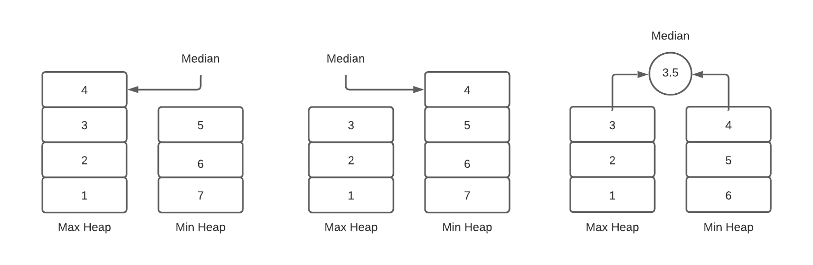
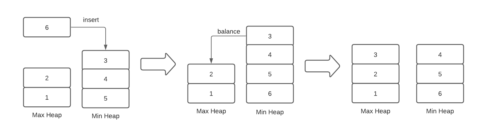

+++
title = "Median Heaps in Haskell"
date = 2021-06-12
description = "An implementation and discussion of a median heap data structure in Haskell."
[taxonomies]
tags = ["haskell", "data-structures"]
[extra]
katex = true
+++

[Heaps](https://en.wikipedia.org/wiki/Heap_(data_structure)) are a fundamental data structure that implement the [priority queue](https://en.wikipedia.org/wiki/Priority_queue) [abstract data type](https://en.wikipedia.org/wiki/Abstract_data_type). Essentially, a priority queue is one where the element at the front of line is always the one of highest *priority*, which is defined by the programmer for a specific implementation. A standard heap implementation provides fast access to the front element of the queue, in $O(1)$ time, as well as insertion/deletion in $O(\text{log}(n))$ time.

Usually, the highest priority value is defined as either the minimum or maximum value in the data, as implemented in min and max heaps respectively. In this post, however, we will look at a more specialized heap that instead prioritizes the *median* value. Why would this be useful? I'm not sure of any practical applications, but assumedly it could be if it were ever performance critical to repeatedly calculate the median. Let's jump in. [^1]

## The Idea

The idea is to actually use two heaps: a max-heap for lesser half of the data, and a min-heap for the greater half. When we want to find the median, we compare the sizes of the two heaps. If the lesser half has one more element, then the median is its maximum value. Conversely, if the greater half has one more element, then the median is its minimum value. Finally, if the two halves have the same number of elements, then the median is the average of the lesser max and the greater min. Since we implement the halves with max and min heaps respectively, we will always be able to find the values we need in constant time. Here's a diagram illustrating these three cases:



Finding the median with this data structure is easy enough, but updating it is a little tricky, since we need to ensure the two halves stay balanced. When we insert an element, we check if it is greater than or less than the current median, and then put it into the correct half accordingly. We then balance the two sides: if one of the halves now has more elements than the other, we take its priority value and put it into the other side. This ensures that the two halves always have the same number of elements (if the total $n$ is even), or one side has one more element than the other (if $n$ is odd). All of these insert and extract operations take $O(\text{log}(n))$ time so our median heap update operation does as well. Here is what the insert and balance steps look like:



In this example, the element to be inserted, $6$, is greater than the current median, $3$, so it goes in the min heap. Then we have to balance the two sides, so we take the priority element from the min-heap and insert it into the max-heap.


## Implementation in Haskell

Let's now turn to the implementation. We will use the [Data.Heap](https://hackage.haskell.org/package/heap-1.0.4/docs/Data-Heap.html) package here, but note that there are several other Haskell packages that implement priority queues that should work as well. We start with our data type, which, as we've discussed, is comprised of a max and a min heap, which come out of the box from the library.

```hs
data MedianHeap a = MedianHeap (MaxHeap a) (MinHeap a)
```

We can now go ahead and write our median function, which takes a `hs›MedianHeap a` and returns `hs›Maybe a`, since it returns `Nothing` if the heap is empty. We also constrain the type of `a` with the `Ord` and `Fractional` typeclasses. The former ensures this is a type that can be stored in a (necessarily ordered) heap, while the latter ensures we can divide it in two. Note the use of `viewHead` from Data.Heap, which takes a `hs›Heap a` and also returns `hs›Maybe a` for the same reason.

```hs
median :: (Ord a, Fractional a) => MedianHeap a -> Maybe a
median (MedianHeap lesser greater)
  | size lesser > size greater = viewHead lesser
  | size lesser < size greater = viewHead greater
  | otherwise = do
      leftHead <- viewHead lesser
      rightHead <- viewHead greater
      return $ (leftHead + rightHead) / 2
```

Notice how in the `otherwise` case, when the two halves are of equal size, the `do` block will return `Nothing` if either side's head is `Nothing`, which would mean that the entire heap must be empty. If they both have a value, we can continue normally and return their average.

Next we can write the `insert` function, which takes a value and a heap and returns the new balanced heap. To implement this, we look at the median of our heap and consider the case that it is `Nothing` and the case that it has a value. If the median is `Nothing`, then our heap is empty, so we will just insert our element into lesser heap. Otherwise if our value to be inserted is greater than the median, we place it in the greater half, and if it is less than the current median, we place it in the lesser half. Finally, in both cases we balance the two sides of the heaps to make sure the median can be accurately found again. Here's the code:

```hs
insert :: (Ord a, Fractional a) => a -> MedianHeap a -> MedianHeap a
insert x heap@(MedianHeap lesser greater) = 
  case median heap of
    Nothing -> MedianHeap (Heap.singleton x) greater
    Just val ->
      if x > val
        then balance $ MedianHeap lesser (Heap.insert x greater)
        else balance $ MedianHeap (Heap.insert x lesser) greater
```

Note that I've qualifed some imports from the Data.Heap package here so they don't conflict with our functions or those from Prelude. To complete this function, we just need to write the `balance` function which we discussed in theory earlier.

Our `balance` function will compare the sizes of the two heaps. If they are equal, our heap is already balanced, so we return without modification. Otherwise, we deconstruct the larger heap into its head and tail -- inserting the head into the other side, and replacing the heap with its tail. This performs the "bumping over" operation illustrated above. 

```hs
balance :: Ord a => MedianHeap a -> MedianHeap a
balance (MedianHeap lesser greater)
  | size lesser == size greater = MedianHeap lesser greater
  | size lesser > size greater =
    let (x, xs) = deconstruct lesser
     in MedianHeap xs (Heap.insert x greater)
  | otherwise =
    let (x, xs) = deconstruct greater
     in MedianHeap (Heap.insert x lesser) xs
  where
    deconstruct heap = case view heap of
      Nothing -> error "cannot view empty heap"
      Just (x, xs) -> (x, xs)
```

Because Data.Heap provides only a 'safe' interface for deconstructing heaps, I've created a helper function `deconstruct`, which converts a heap from Data.Heap into its head and tail, throwing a runtime error if it is empty. In this case, this error will never be thrown, since we don't modify the median-heap if it is empty, since the sizes of both sides would be zero.

With this, the main functions of interacting with our median-heaps are complete, so all that's left is to add some helper functions for converting from lists. First, let's write `fromAscList`, (asc short for ascending) which will just split the list at its middle element (the median), and put its lesser and greater halves into our median heap using the $O(n)$ functions `Heap.fromDescList` and `Heap.fromAscList`. Since the lesser side is a max-heap, a list like `hs›[1, 2, 3]` is actually in *descending* order (the first item to be removed from the heap is last), so we use the corresponding function for that side.

```hs
fromAscList :: Ord a => [a] -> MedianHeap a
fromAscList xs =
  let (lesserList, greaterList) = splitAt (length xs `div` 2) xs
   in MedianHeap (Heap.fromDescList lesserList) (Heap.fromAscList greaterList)
```

And finally a generic `fromList`, which will just sort the list first before applying `fromAscList`:
```hs
fromList :: Ord a => [a] -> MedianHeap a
fromList = fromSortedList . sort
```

Simple enough. 

## Conclusion & Performance

To make sure this works, lets try a few examples:
```hs
> median $ fromList [1, 2, 5, 3, 4] -- => Just 3
> median $ fromList [1, 2, 3, 4]    -- => Just 2.5
```

Note that converting from an unsorted list and then finding the median from our heap data structure is slower than [an optimal linear time algorithm on an unsorted list](https://rcoh.me/posts/linear-time-median-finding/). Instead, we would need $O(n \cdot \text{log}(n))$ time to sort, and $O(n)$ time to convert from sorted list to heap. However, the advantage of using this median-heap would come if we needed to repeatedly find the median, since once our data is in the heap, we can always find the median in $O(1)$ and update in $O(\text{log}(n))$. If we can bear the initial overhead to model our data in this heap, it should pay off in the long term to not have to scan the entire data set to find the median.

That's all I have here, but please reach out with any questions or comments!

### Notes
[^1]: This post is inspired by another [blog post](https://www.erichgrunewald.com/posts/using-scheme-to-find-the-median-of-two-sorted-integer-lists/), which shows how to find the median of two sorted lists in linear time. That got me thinking, though, if it we already had sorted data, whether there was a better data structure for the problem.