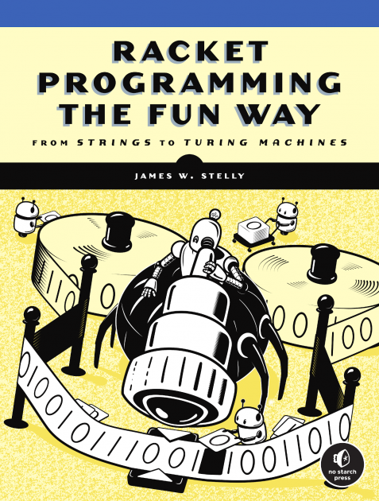

+++
title = "Book Review: Racket Programming the Fun Way by James Stelly"
date = 2021-01-18
description = "A review of the new Racket programming book."
[taxonomies]
tags = ["racket"]
+++

If you look around the web for reasons why you should learn Racket, or its ancestors Lisp and Scheme, you'll find no shortage of answers. On Racket's official website, it is proudly named the [*language-oriented programming language*](https://racket-lang.org/). For Matthew Butterick, author of *[Beautiful Racket](https://beautifulracket.com/)*, it's Racket's [*beauty* and *expressiveness*](https://beautifulracket.com/appendix/why-racket-why-lisp.html) that draw him to it. And for others, like programmers Eric Raymond and Paul Graham, it is worth learning for its [*profound enlightenment*,](http://www.catb.org/esr/faqs/hacker-howto.html) or because it can be used as a [*secret weapon*.](http://www.paulgraham.com/avg.html)

These are all compelling answers that reflect the truly wide variety of programmers that the Lisp family of languages attract. But none of these are why James Stelly has written his new book, [*Racket Programming the Fun Way*](https://nostarch.com/racket-programming-fun-way). Instead, as its name suggests, Stelly thinks you should learn Racket because it is just plain *fun*.

There's good reason for Stelly's appraisal, as Racket's simple and consistent syntax makes it an ideal language for new programmers, as well as those who are tired of the all-too-similar C-like languages. Out of the box, Racket also includes [DrRacket](https://docs.racket-lang.org/drracket/), a graphical IDE, and boasts a large standard library for creating [GUIs](https://docs.racket-lang.org/gui/), [drawings](https://docs.racket-lang.org/draw/index.html), [games](https://docs.racket-lang.org/games/index.html), [math plots](https://docs.racket-lang.org/plot/), and much more.

At first glance, the book certainly seems to align with this sentiment. Stelly's writing is light and inviting, and the book's playful cover matches the little illustrations and diagrams scattered throughout the text. 

After the introductory chapters, which cover the basics of s-expressions, linked lists, lambda functions, and core standard library functions, Stelly begins to build on the foundation he has laid. The next three chapters deal with Racket's graphical capabilities, covering math plots, GUIs, and data visualizations. In all of these, Stelly finds ways to keep the mathematically-inclined reader engaged by introducing some basic concepts in set theory, trigonometry, and statistics. For me, though, the most interesting parts of these chapters come in their respective "applications" sections, where Stelly tiles Fibonacci numbers and implements [the game of Nim](https://en.wikipedia.org/wiki/Nim), among other diversions.

The book's strongest chapters, however, and the ones that would persuade me to recommend the book to experienced yet curious programmers, come at the end. In these, Stelly addresses graph theory, logic programming, pushdown automata and Turing machines, and finally, lexing and parsing. Importantly, many of these concepts are addressed in a purpose-driven way that is designed to solve problems: implementing depth first search helps Stelly solve Sudoku, while the parsing chapter is centered around building a functional algebraic calculator.

While the more advanced computer science topics addressed in these chapters can seem intimidating, Stelly covers them in a way that does them justice while still being approachable to those without a formal CS education. Even though these topics may not be covered with the same rigor as a [CLRS](https://en.wikipedia.org/wiki/Introduction_to_Algorithms) or [SICP](https://mitpress.mit.edu/sites/default/files/sicp/full-text/book/book.html), I think the clear diagrams and readable Racket code presented in these sections serve as a great way for those who want to learn more to gain valuable intuition before studying the concepts more in depth.

My only complaint is that I wish Stelly had included more exercises at the end of these chapters, since they are deep topics that warrant more exploring by the reader. It is also disappointing that Stelly did not find any space to include a treatment of Racket [macros](https://docs.racket-lang.org/guide/macros.html), since they are one of the most unique and powerful features of the language.

Still, *Racket Programming the Fun Way* is a decidedly fun and informative read that I would recommend both to novice Racket programmers and those who are looking to take a bit of a deeper dive into the language. Stelly's book joins good company alongside *Beautiful Racket* and [*How To Design Programs*](https://htdp.org/) as excellent books on Racket, which can hopefully bring the language to a wider audience in the programming community.

### Acknowledgements

I received a physical review copy from No Starch Press, but was not otherwise compensated for this review.
